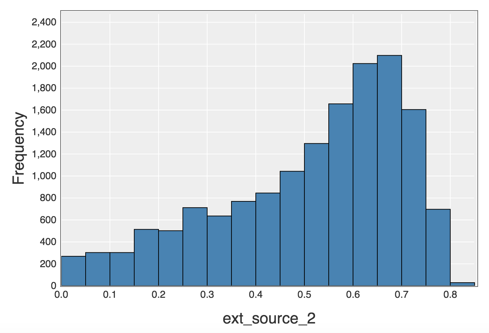

# Home Credit Default Risk Prediction

## Introduction
Credit risk evaluation is one of the important topics in finance. The evaluation is highly challenging and one of the main reasons is that the records of credit histories are sometimes not sufficient. As a result, many people struggle to get loans. The reason why people want to study this dataset is that they hope to help this underserved population have a positive loan experience. The primary task is to develop some reliable models to predict clients' repayment abilities and credit risk based on a variety of alternative data provided by Home Credit.

"target" variable is the prediction which indicates whether the user is positive or negative in credit risk.

The main reason why Home Credit wants to run this competition is to find more underserved population and provide lending service. They have used various machine learning models to make the predictions, and now they want to improve the performance of prediction so that some clients are not rejected due to insufficient data on credit. This action is business-motivated.

## Method
In this project, I have tried three different methods. They include linear regression, logistic regression and decision tree. From testing results, logistic regression performs better (stable and relatively good score) than other two. This makes sense because logistical regression is often used for prediction of binary results. In this project, the output (i.e. target) is binary. Therefore theoretically logistical regression can fit into the scenario well. In contrast, it is expected that linear regression can not do a good job because their output is continuous. In addition, decision tree seems to fit into this scenario because its output can be binary. However, when I tried decision tree, I found that the calculation is very complex when there are hundreds of features. The processing is very time consuming. In order to avoid taking too long time to get model built, I have to limit the features in each layer as well as the height of the tree. The results are not good (unstable and relatively low score). Therefore, I adopt logistic regression as main prediction model for this project. After some optimisation including normalization, finally I can use the model to get a AUC of 0.709.

## Data Source
https://www.kaggle.com/c/home-credit-default-risk

## Data Analysis
* Data review for selecting clustering algorithm
First make a review of data types. There exist a lot of numerical features and the output is binary, logisitc regression and descision tree may be suitable for these types of data. If we use decision tree, hundreds of features will lead to a very complex tree. When I test the model with all the features locally, it can not be finished after long-time wait. When reducing tree height and maximum of features, the AUC score is low. Finally I have decided to select logistic regression as main ML algorithms used for this project.

* Label analysis for selecting evaluation methods
Next we need select a reliable model evaluation method. After checking the output "label", I found that its main characteristic is inbalanced distribution: 90% of values is 0. This means that we can not use accuracy as main evaluation of the model. Image even if our model have returned 0 for all inputs, the accuracy can be still judged as high as 90%. In this context, the evaluation based on accuracy does not make sense. Instead, AUC can be adopted for evaluation. AUC can tell how much model is capable of distinguishing between classes. Higher the AUC, better the model is at predicting binary results.

* Test different feature combination for initial feature selection
In this step of data analysis, I have test many feature combinations and finally selected these three features (ext_source_1, ext_source_2, ext_source_3) to build logistic regression models. Through modifying the parameters, I can obtain the AUC of 0.7045. The plots below show statistical results of these 3 features. From the figures, we can see that there are a lot of missing data in ext_source_1. In contrast, ext_source_2 has very few missing data and importantly it has an inbalanced distribution which is consistent with the distribution of "label". Therefore, it is expected that ext_source_2 can play an important role in prediction model.

* Analyze the impact of features in the same table
In this step of data analysis, I have examined the impact of adding other features on the same table. After some tests, I found that other features in application_train table has very little impact on AUC score.

* Analyzing the impact of features in other tables
In this step of data analysis, I have examined the impact of adding more features from other tables. After testing a lot of feature combinations, I found adding these 3 features ("amt_credit_sum", "amt_credit_sum_debt", "amt_annuity") from the table "bureau" and use the aggregration "average/sum" can improve AUC score to 0.7090.

* Analyzing the impact of more aggregation methods
In this step of data analysis, I have test other aggregation methods including min, max, count et al., I did not find an apparent increase in AUC score.

## Results

* Overview of Experimental Results
Question	Features	Tables	Algorithms	AUC

* Interpretation of Experimental Results
When I select the features in main table arbitrarily, I only obtain the AUC score of 0.5578. After I select 3 features ("ext_source_1", "ext_source_2", "ext_source_3") by comparing various feature combinations, I can improve the AUC score to 0.6845. By feature normalization, I can improve the AUC score to 0.7058. In order to improve AUC further, I have integrated numerical features from other tables and tried aggregation, the results can be improved to 0.7090. The model in the best performance so far include these 6 features:

"ext_source_1", "ext_source_2", "ext_source_3", "amt_credit_sum", "amt_credit_sum_debt", "amt_annuity"

The figure below shows how the ROC looks:

* Potential Improvements
I think I could have done better if I have more time for processing these data deeply. The first improvement I would do is to use more complex methods to combine & aggregation the data from different tables. Though I have test some, it may be not enough. There are still a lot of combination worthy further examination. The second improvement I would do is to try more advanced ML algorithms like LGBM. Though there is still some improvement space for logistic regression model, its increase may not be big based on my tests. I doubt that it can reach the AUC of 0.8 or higher with its full potential.

In addition, there are a few award-winning algorithms mentioned in this discussion thread [link]. I would like to do more research on these algorithms and test them with our data.

## Conclusion

In this project, I have these 4 main findings. The first is that logistic regression can do a relatively good job in prediction of credit risk. By serial optimisations in features and model parameters, I can obtain the AUC of 0.709 based on the dataset in this project. The second finding is that feature selection plays a very important role in prediction. By just modifying selected features, the AUC can be improved apparently. This indicates that in machine learning, feature engineering is necessary. Without it, best algorithms may fail. The third finding is that some aggregation can help in improve prediction performance. By adopting just normalization, the AUC score has been improved to some extent. Due to the diversity of data range, normalisation seems to eliminate its impact in some extent. The fourth finding is that the performance of the logistic regression can not be improved further probably because of the existence of a lot of missing data.

If someone wants to use my solution, I would recommend them to spend enough time on the selection of features. The selected features are highly related to dataset, so it is crucial for them to investigate feature properties and associations and make careful selections when they use my solution for other datasets.

If I have more data, I would test logistic regression model with them and then compared with other advanced models like LGBM. Again before doing this, I will run the tests for many times to figure out the the best features which can be used for prediction model. In addition, I will handle the missing data better when I have more dataset, maybe fill missing data with the help of more supporting data. If the company seeks to run my method at high scale, I think they need consider operation speed. When the dataset is very large, the model will become slow and they may need run the model in distributed environment. Also they may want to run feature selection and prediction models for many times in order to obtain a reliable results in practice.

## References

[1] Lee, T. S., Chiu, C. C., Chou, Y. C., & Lu, C. J. (2006). Mining the customer credit using classification and regression tree and multivariate adaptive regression splines. Computational Statistics & Data Analysis, 50(4), 1113-1130.

[2] Credit Risk Assessment using Statistical and Machine Learning: Basic Methodology and Risk Modeling Applications link

[3] Wang, Y., Wang, S., & Lai, K. K. (2005). A new fuzzy support vector machine to evaluate credit risk. IEEE Transactions on Fuzzy Systems, 13(6), 820-831.

[4] Khandani, A. E., Kim, A. J., & Lo, A. W. (2010). Consumer credit-risk models via machine-learning algorithms. Journal of Banking & Finance, 34(11), 2767-2787.

[5] Lai, K. K., Yu, L., Zhou, L., & Wang, S. (2006, July). Credit risk evaluation with least square support vector machine. In International Conference on Rough Sets and Knowledge Technology (pp. 490-495). Springer, Berlin, Heidelberg.
